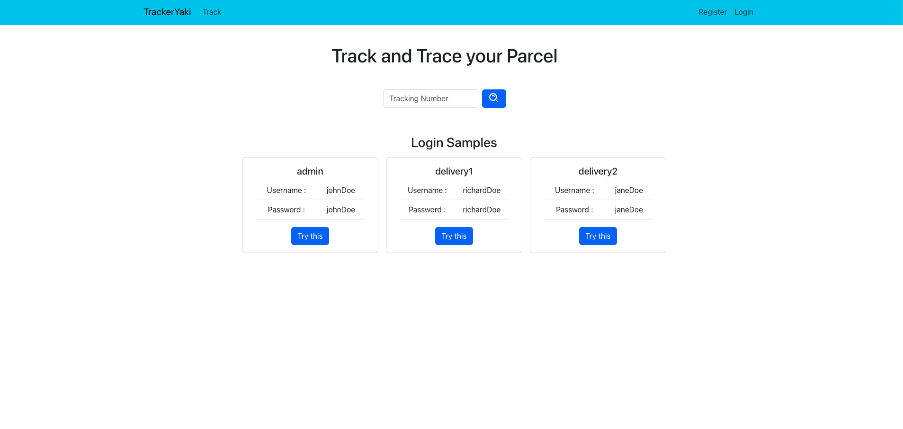
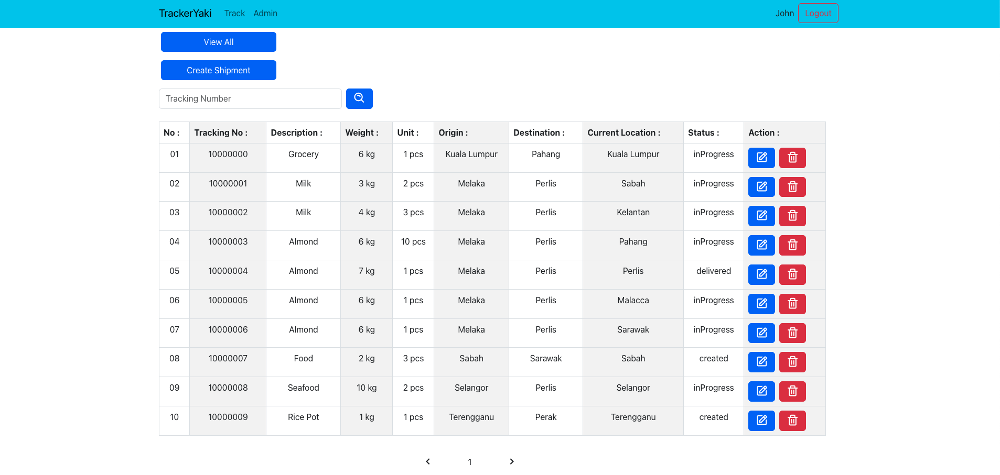
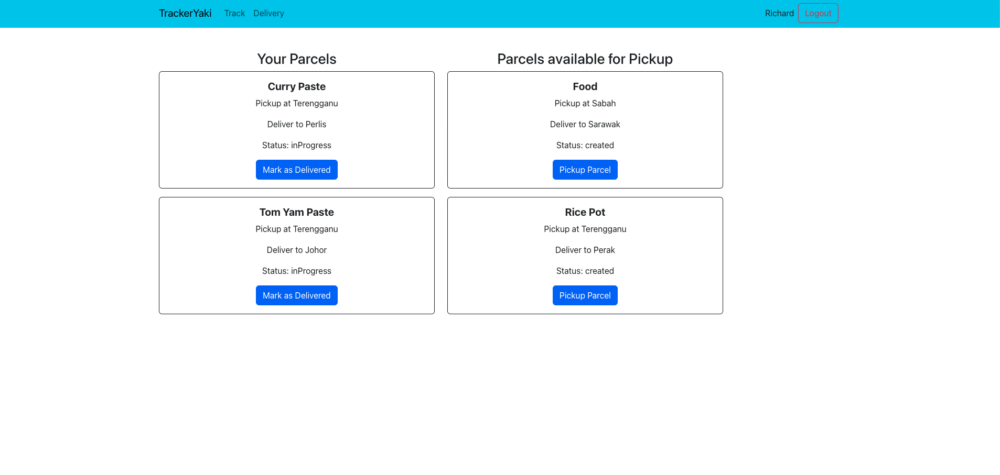

# TrackerYaki

## Table of Contents
* [General Info](#general-info)
* [Features](#features)
* [Tech Stack](#tech-stack)
* [Improvement](#improvement)
* [Lesson Learnt](#lesson-learnt)
* [Overview](#overview)

## General Info
This logistics management app is designed to streamline the process of managing and tracking shipments. It includes separate interfaces for admin users and delivery personnel, with distinct functionalities for each.

## Features
- **Admin Role:**
  - Create, edit, and delete shipments.
  - Track all shipments in the system.
- **Delivery Role:**
  - View and pick up newly created shipments.
  - Mark shipments as delivered.
- **Shipment Tracking:**
  - Track shipment status by providing the shipment number.
  - View details such as items, location, status, origin, destination, and weight.

## Tech Stack
- **Frontend:** React.js
- **Backend:** Node.js, Express.js, 
- **Database:** MongoDB
- **Autentication :** Jsonwebtoken
- **Deployment:** Vercel

## Improvement
- **Data fetching:**
  - The tracking function in the apps is a filter method based on all the data get from the backend. This might not be the ideal way of tracking data if the data is heavy to retrieve all. Doing it at the backend will be a better way.
- **Structure of files**
  - It would be better to separate into different files instead of squeezing all the datas in one file. It will make the document easier to be read.
- **Adding more features**
  - Task deligation will be a great features to assign task to different delivery staff. The current feature only allow delivery staff to select which shipment to pick up and deliver.
  - Add a input field for delivery staff to make a remark whenever needed.
- **User Experience**
  - More loading or error alerting features need to be added to let the user get a glimpse of something's happening in the background.

## Lesson Learnt
- Planning is key of the project. It has to be planned properly in order to prevent unrealistic goal based on the timeline given.
- Time management is always challenging to meet specific deadline without compromising quality of project.
- As this is a team project, communication wihtin the team can prevent the confusion and ensure everyone understand their responsibility and goal achivement.
- Version control is crucial when committing to the github. It can help to ease the complilation and ensure all team members have the latest code.

## Overview
Here are some screenshot from the app in different users' perspective.

Landing page for normal user

Landing page for admin user once logged in

Landing page for delivery user once logged in

